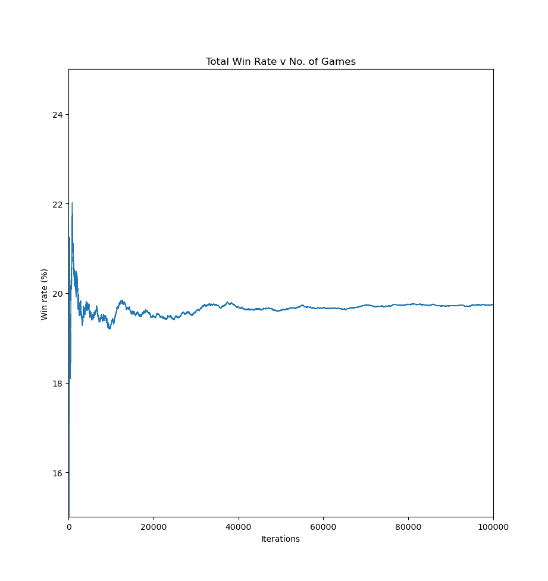

# Napoleon's Tomb Solitaire Simulator

A Python program run simulations of the solitaire game called "Napoleon's Tomb", played with a standard deck of 52 playing cards. [Here is a YouTube video (not mine) explaining the rules](https://www.youtube.com/watch?v=0jcmCQDrc4c) (or see [Rules section below](#rules)).

The aim is to numerically find the chance of winning a given hand by simulating `n` trials. Empirically, the win rate is approx. 19.756%. (from 100000 trials). 

Simply run:
```
python main.py -n <number_of_trials>
```
where `<number_of_trials>` is the number of trials to run. The program will display a progress bar and will print the win percentage when finished.

The optional `-p final` or `-p live` options both show a graph showing win percentage against number of iterations, with the former displaying at the end and the latter showing it live. The live graph is considerably slower.

Below is an example plot from a run of 100000 trials, showing convergence to ~20%:



## Requirements
Requires `tqdm`, `numpy` and `matplotlib`. Install with pip or conda (`python -m pip install matplotlib numpy tqdm` or `conda install matplotlib numpy tqdm`). Tested with Python 3.10.10 but will probably work with most other versions.

## Rules
Napoleon's Tomb is a building game, in which the aim is to have 5 piles of cards: four going from 7-K, and one going from 6-A four times. The player wins when this is the case (and therefore there are no cards in the discard pile, the deck, or any of the spares piles).

The tableau is split into a 3x3 grid of 9 piles, and a further two piles to the side (plus the deck):
- 4 piles (the 7s piles) in the corners of the grid that start at 7 and count up to K,
- 4 single-card piles (the spares) at the top, right, left, and bottom edges of the 3x3 grid that hold a single spare card each,
- 1 pile (the 6s pile) in the centre of the grid in which cards must count down from 6-A four times consecutively,
- A pile (the spare 6s pile) for spare 6s to be kept for later use, if drawn,
- A discard pile, in which useless cards are placed.

Play proceeds as follows:
1. The deck is shuffled.
2. A card is drawn from the top of the deck.
3. If the card:
	1. Is a 7, then it is placed in an empty corner space to begin a 7s pile,
	2. Is a 6, then it is placed on the 6s pile if the 6s pile is either empty or has an A on top, else it is placed in the spare 6s pile.
	3. Is neither 7 nor 6, then it goes to an empty spares slot if available, else the discard pile.
4. The player begins trying to match the tableau:
	- If there are empty spaces in the spares piles, these are filled first from the discard, then from the deck if the discard is empty.
	- If the spares or the top of the discard pile can be placed on a 7s or 6s pile, then this is done.
		- 7s piles build upwards: 789TJQK
		- 6s build downwards and wrap back from A-6: 65432A65432A65432A65432A
	- If no moves can be made on the tableau, a card is drawn from the deck.
5. If the player has no cards in the deck and no legal moves on the tableau, they lose. If they have no cards in the spares piles, no cards in the deck, and no cards on the discard pile, they win.


